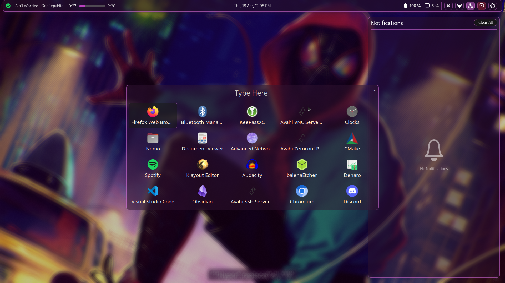

# Hyprverse
Dotfiles for my Spiderverse-themed [Hyprland](https://hyprland.org) configuration on Arch Linux with NVIDIA dGPU + Intel CPU Laptop.

> **WARNING** Some information in this README is outdated.

See also: My personal [VSCode theme](https://github.com/harshkhandeparkar/personal-vscode-theme) and [Obsidian theme](https://github.com/harshkhandeparkar/personal-obsidian-theme).

### Installation Script
1. Clone this repository.
2. Run the `link.sh` script to link the dotfiles to the respective locations. Run with `--copy` flag to copy all the files instead of linking.
> **WARNING** THIS WILL DELETE EXISTING CONFIG DIRECTORIES.

### Packages
1. [Hyprland](https://hyprland.org) - Window Manager
2. [Hyprpaper](https://github.com/hyprwm/hyprpaper) - Wallpaper
3. [Swaylock Effects](https://github.com/mortie/swaylock-effects) - Lock screen
4. [Sway Notification Center](https://github.com/ErikReider/SwayNotificationCenter) - Notification Center
5. [BrightnessCTL](https://github.com/Hummer12007/brightnessctl) - For monitor brightness keybinds
6. [EWW](https://github.com/elkowar/eww) - For widgets
7. [Pipewire](https://wiki.archlinux.org/title/PipeWire) and [Wireplumber](https://wiki.archlinux.org/title/WirePlumber) - For audio controls
8. [Playerctl](https://github.com/altdesktop/playerctl) - For media controls
9. [Grimblast](https://github.com/hyprwm/contrib#grimblast) - For screenshots
10. [Kitty Terminal](https://github.com/kovidgoyal/kitty) - Default terminal
11. [Cava](https://github.com/karlstav/cava) - Audio visualizer
12. [NetworkManager](https://wiki.archlinux.org/title/NetworkManager) and [nmcli](https://wiki.archlinux.org/title/NetworkManager#nmcli_examples) - Network controls
13. [Rofi (wayland fork)](https://github.com/lbonn/rofi) and [Rofi themes](https://github.com/lbonn/rofi/tree/wayland/themes) - App launcher menu

### Images
- Wallpaper: `~/.backgrounds/miles-morales-4.jpg` from [r/wallpaper](https://www.reddit.com/r/wallpaper/comments/11hnhad/3840x2160_miles_morales/).
- Icons: `eww/img/` from [Yaru theme](https://github.com/ubuntu/yaru).

### System
- Laptop: Asus TUF F15 2021
- dGPU: NVIDIA GTX 1650ti
- CPU: Intel i5-10300H
- OS: Arch Linux
	- Kernel: `linux`
	- NVIDIA Driver: `nvidia-open`
	- Bootloader: `GRUB`
	- Display Manager: `SDDM`

### Components
#### Hyprland
- Dotfiles: `hypr/`
- Config Directory: `~/.config/hypr`
- See [hypr/README.md](./hypr/README.md)

#### EWW
- Dotfiles: `eww/`
- Config Directory: `~/.config/eww`
- See [eww/README.md](./eww/README.md)

#### Rofi
- Dotfiles: `rofi/`
- Config Directory: `~/.config/rofi`
- See [rofi/README.md](./rofi/README.md)

#### Swaylock
- Dotfiles: `swaylock/`
- Config Directory: `~/.config/swaylock`
- See [swaylock/README.md](./swaylock/README.md)

#### SwayNotificationCenter
- Dotfiles: `swaync/`
- Config Directory: `~/.config/swaync`
- See [swaync/README.md](./swaync/README.md)

#### Cava
- Dotfiles: `cava/`
- Config Directory: `~/.config/cava`
- See [cava/README.md](./cava/README.md)

### Images

